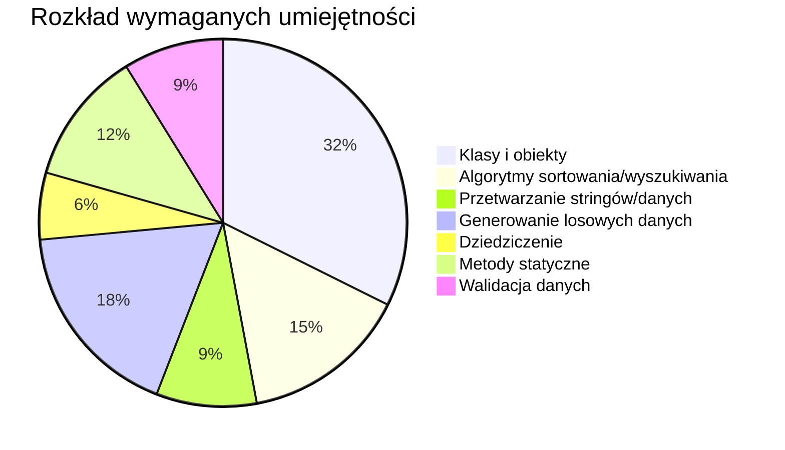

# Analiza arkuszy INF.04 — Część I: Aplikacja konsolowa

> [!NOTE]
> Analiza obejmuje 16 arkuszy egzaminacyjnych z lat 2021–2026. Skupiam się wyłącznie na **Części I** (aplikacja konsolowa). Wszystkie zadania wymagają rozwiązania w jednym z języków: C++, C#, Java lub **Python**.

---

## 📋 Spis zadań — arkusz po arkuszu

### 1. 🗓️ 2021 – Czerwiec 1

| Aspekt | Szczegóły |
|---|---|
| **Temat** | Sortowanie przez wybieranie (Selection Sort) – malejąco |
| **Kategoria** | 🔢 Algorytmika + 🏗️ Obiektowość |
| **Opis** | Zaimplementować algorytm sortowania przez wybieranie dla tablicy 10 liczb całkowitych wczytanych z klawiatury, sortowanie **malejąco**. Tablica jest **polem klasy**. Klasa zawiera minimum dwie metody: sortującą i szukającą wartość maksymalną (prywatną). |
| **Trudność** | ⭐⭐ Niska-średnia |
| **Kluczowe umiejętności** | Algorytm sortowania, klasy (pola, metody), hermetyzacja (metoda prywatna), wejście/wyjście |
| **Narzędzia Python** | `class`, `input()`, `print()`, pętle `for`, listy |

---

### 2. 🗓️ 2022 – Styczeń 1

| Aspekt | Szczegóły |
|---|---|
| **Temat** | Sortowanie przez wybieranie (Selection Sort) – **identyczne jak 2021 Cze 1** |
| **Kategoria** | 🔢 Algorytmika + 🏗️ Obiektowość |
| **Opis** | Dokładnie to samo zadanie co 2021 Czerwiec 1 — sortowanie malejące tablicy 10 liczb, klasa z dwoma metodami. |
| **Trudność** | ⭐⭐ Niska-średnia |
| **Kluczowe umiejętności** | Identyczne jak powyżej |
| **Narzędzia Python** | Identyczne jak powyżej |

---

### 3. 🗓️ 2022 – Czerwiec 1

| Aspekt | Szczegóły |
|---|---|
| **Temat** | Przeszukiwanie tablicy z wartownikiem (Sentinel Search) |
| **Kategoria** | 🔢 Algorytmika |
| **Opis** | Zaimplementować algorytm wyszukiwania z wartownikiem na tablicy min. 50 elementów wypełnionej losowymi liczbami 1–100. Wartość szukana pobierana z klawiatury. Wyświetlenie tablicy + indeks znalezionego elementu lub komunikat o braku. |
| **Trudność** | ⭐⭐ Niska-średnia |
| **Kluczowe umiejętności** | Algorytm wyszukiwania, generowanie liczb pseudolosowych, funkcje, tablice |
| **Narzędzia Python** | `random.randint()`, listy, funkcje, `input()`, `print()` |

---

### 4. 🗓️ 2022 – Czerwiec 2

| Aspekt | Szczegóły |
|---|---|
| **Temat** | Klasa Osoba — forum użytkowników (konstruktory, pole statyczne, metoda) |
| **Kategoria** | 🏗️ Obiektowość (czysta) |
| **Opis** | Zaprojektować klasę `Osoba` z: dwoma polami (`id`, `imie`), polem statycznym zliczającym instancje, trzema konstruktorami (bezparametrowy, z parametrami, kopiujący), metodą wypisania imienia. W Pythonie — konstruktor z wartościami domyślnymi + metoda kopiująca. |
| **Trudność** | ⭐⭐⭐ Średnia |
| **Kluczowe umiejętności** | OOP: konstruktory, pola statyczne, hermetyzacja, kopiowanie obiektów, dostępność pól |
| **Narzędzia Python** | `class`, `__init__` z domyślnymi, zmienne klasowe (`cls`), `copy` lub ręczne kopiowanie |

---

### 5. 🗓️ 2023 – Styczeń 1

| Aspekt | Szczegóły |
|---|---|
| **Temat** | Algorytm Euklidesa — NWD (Największy Wspólny Dzielnik) |
| **Kategoria** | 🔢 Algorytmika (czysta) |
| **Opis** | Zaimplementować algorytm Euklidesa na podstawie podanego schematu blokowego. Funkcja z dwoma argumentami, zwraca NWD. Nie może zawierać operacji I/O. Program główny testuje. |
| **Trudność** | ⭐⭐ Niska |
| **Kluczowe umiejętności** | Algorytm Euklidesa, funkcje, pętla while, operacja modulo |
| **Narzędzia Python** | Funkcje, `%` (modulo), `while`, `input()`, `int()` |

---

### 6. 🗓️ 2023 – Styczeń 2

| Aspekt | Szczegóły |
|---|---|
| **Temat** | Klasa Notatka — obsługa notatek |
| **Kategoria** | 🏗️ Obiektowość (czysta) |
| **Opis** | Klasa `Notatka` z: polem statycznym (licznik), id (auto-inkrementowane), tytuł, treść. Konstruktor z parametrami. Dwie metody: wyświetlenia tytułu/treści i diagnostyczna (wszystkie pola oddzielone średnikami). Hermetyzacja z rozróżnieniem `private` vs `protected`. |
| **Trudność** | ⭐⭐ Niska-średnia |
| **Kluczowe umiejętności** | OOP: pola statyczne, auto-ID, konstruktor, metody, hermetyzacja (private vs protected) |
| **Narzędzia Python** | `class`, `__init__`, zmienne klasowe, `_` i `__` (konwencja nazewnicza dla dostępności) |

---

### 7. 🗓️ 2023 – Czerwiec 1

| Aspekt | Szczegóły |
|---|---|
| **Temat** | Sito Eratostenesa — liczby pierwsze w zakresie 2..100 |
| **Kategoria** | 🔢 Algorytmika (czysta) |
| **Opis** | Przekształcić podany pseudokod sita Eratostenesa do aplikacji konsolowej. Tablica logiczna, wykreślanie wielokrotności. Wypełnianie tablicy w osobnej funkcji, do √n. |
| **Trudność** | ⭐⭐ Niska-średnia |
| **Kluczowe umiejętności** | Algorytm sita Eratostenesa, tablice logiczne, pętle zagnieżdżone, `math.sqrt()` |
| **Narzędzia Python** | `math.sqrt()` lub `**0.5`, listy z wartościami `True/False`, `range()` |

---

### 8. 🗓️ 2023 – Czerwiec 2

| Aspekt | Szczegóły |
|---|---|
| **Temat** | Sortowanie bąbelkowe (Bubble Sort) — rosnąco |
| **Kategoria** | 🔢 Algorytmika |
| **Opis** | Implementacja sortowania bąbelkowego dla 100 pseudolosowych liczb całkowitych. Sortowanie rosnąco. Bez gotowych funkcji sortowania/zamiany. Funkcja sortująca przyjmuje tablicę, nie zwraca wartości. |
| **Trudność** | ⭐⭐ Niska |
| **Kluczowe umiejętności** | Algorytm Bubble Sort, generowanie losowych danych, funkcje |
| **Narzędzia Python** | `random.randint()`, listy, funkcje, pętle zagnieżdżone |

---

### 9. 🗓️ 2023 – Czerwiec 3

| Aspekt | Szczegóły |
|---|---|
| **Temat** | Klasa Film — wirtualna wypożyczalnia (gettery, settery, inkrementacja) |
| **Kategoria** | 🏗️ Obiektowość (czysta) |
| **Opis** | Klasa `Film` z: polami `tytuł` i `liczba_wypozyczeń` (protected). Gettery, setter dla tytułu, metoda inkrementacji wypożyczeń. Inicjalizacja wartościami pustymi/0. Testy w programie głównym. |
| **Trudność** | ⭐⭐ Niska |
| **Kluczowe umiejętności** | OOP: gettery/settery, enkapsulacja, protected, metoda bez argumentów |
| **Narzędzia Python** | `class`, `@property`, `_` prefix (protected), `__init__` |

---

### 10. 🗓️ 2024 – Styczeń 1

| Aspekt | Szczegóły |
|---|---|
| **Temat** | Walidacja numeru PESEL (płeć + suma kontrolna) |
| **Kategoria** | 🔢 Algorytmika + 🔤 Przetwarzanie danych |
| **Opis** | Program sprawdzający poprawność numeru PESEL: funkcja sprawdzająca płeć (zwraca 'K'/'M'), funkcja sprawdzająca sumę kontrolną (zwraca bool). Algorytm wag: 1,3,7,9,1,3,7,9,1,3 + operacja modulo. PESEL jako string lub tablica. |
| **Trudność** | ⭐⭐⭐ Średnia |
| **Kluczowe umiejętności** | Przetwarzanie stringów, tablice wag, modulo, funkcje z wartością zwrotną, walidacja |
| **Narzędzia Python** | Operacje na stringach, `int()`, `%`, `for`/`zip`, `input()` |

---

### 11. 🗓️ 2024 – Styczeń 2

| Aspekt | Szczegóły |
|---|---|
| **Temat** | Klasa narzędziowa do operacji na stringach (samogłoski + usuwanie duplikatów) |
| **Kategoria** | 🏗️ Obiektowość + 🔤 Przetwarzanie stringów |
| **Opis** | Klasa z **metodami statycznymi** (nie tworzy się obiektów). Dwie metody: (1) licząca samogłoski (w tym polskie: ąęóAĄEĘÓ), (2) usuwająca powtórzenia znaków obok siebie. Obsługa null/pusty string. |
| **Trudność** | ⭐⭐⭐ Średnia |
| **Kluczowe umiejętności** | Metody statyczne, przetwarzanie stringów, obsługa edge-case'ów, polskie znaki |
| **Narzędzia Python** | `@staticmethod`, operacje na stringach, iteracja po znakach, `if/else` |

---

### 12. 🗓️ 2025 – Styczeń 1

| Aspekt | Szczegóły |
|---|---|
| **Temat** | Klasa do operacji na tablicach (wyświetlanie, wyszukiwanie, nieparzyste, średnia) |
| **Kategoria** | 🏗️ Obiektowość + 🔢 Algorytmika |
| **Opis** | Klasa z: tablicą (private), liczbą elementów (private). Konstruktor wypełniający pseudolosowymi 1–1000. Cztery metody: wyświetl, wyszukaj (zwraca indeks/-1), wyświetl nieparzyste (zwraca ich liczbę), policz średnią. Rozmiar >20. |
| **Trudność** | ⭐⭐⭐ Średnia |
| **Kluczowe umiejętności** | OOP kompletne: konstruktor, pola prywatne, metody z różnymi typami zwrotnymi, wyszukiwanie liniowe, średnia |
| **Narzędzia Python** | `class`, `__init__`, `random.randint()`, `__pola` (name mangling), `sum()/len()` |

---

### 13. 🗓️ 2025 – Styczeń 2

| Aspekt | Szczegóły |
|---|---|
| **Temat** | Dziedziczenie — klasa bazowa Urządzenie + Pralka + Odkurzacz |
| **Kategoria** | 🏗️ Obiektowość zaawansowana (dziedziczenie) |
| **Opis** | Klasa bazowa z metodą wyświetlania komunikatu. Klasa Pralka: pole nr programu (prywatne), metoda ustawiania (1-12 lub 0). Klasa Odkurzacz: pole stan (bool), metody `on()`/`off()` z logiką ochrony przed podwójnym wł/wył, wywołanie metody bazowej. |
| **Trudność** | ⭐⭐⭐⭐ Średnia-trudna |
| **Kluczowe umiejętności** | Dziedziczenie, `super()`, hermetyzacja, logika stanów, warunki kontrolne |
| **Narzędzia Python** | `class`, dziedziczenie (`class Pralka(Urzadzenie)`), `super().__init__()`, `__pole` |

---

### 14. 🗓️ 2025 – Czerwiec 1

| Aspekt | Szczegóły |
|---|---|
| **Temat** | Loteria liczbowa — losowanie zestawów 6 z 49 |
| **Kategoria** | 🔢 Algorytmika + 🎲 Losowość |
| **Opis** | Program wczytuje liczbę zestawów z klawiatury, losuje zestawy 6 unikalnych liczb 1-49, wyświetla je. Zlicza statystyki wystąpień każdej liczby 1-49 we wszystkich zestawach. Tablica 2D (n×6). Dwie funkcje: wypełniająca i wyświetlająca. |
| **Trudność** | ⭐⭐⭐ Średnia |
| **Kluczowe umiejętności** | Tablice 2D, losowanie bez powtórzeń, zliczanie wystąpień, funkcje |
| **Narzędzia Python** | `random.sample()` lub `random.randint()` + sprawdzanie, listy 2D, `Counter` lub ręczne zliczanie |

---

### 15. 🗓️ 2025 – Czerwiec 2

| Aspekt | Szczegóły |
|---|---|
| **Temat** | Szyfr Cezara |
| **Kategoria** | 🔢 Algorytmika + 🔐 Kryptografia |
| **Opis** | Implementacja szyfru Cezara: funkcja/metoda przyjmująca tekst jawny i klucz, zwracająca tekst zaszyfrowany. Klucz: dowolna liczba całkowita (dodatnia, ujemna, >26, =0). Działa tylko na małych literach łacińskich + spacja. Kody ASCII 97–122. |
| **Trudność** | ⭐⭐⭐ Średnia |
| **Kluczowe umiejętności** | Operacje na ASCII (`ord()`, `chr()`), modulo z zawijaniem, obsługa kluczy ujemnych/dużych |
| **Narzędzia Python** | `ord()`, `chr()`, `%` (modulo 26), `input()`, `str.join()` |

---

### 16. 🗓️ 2026 – Styczeń 1

| Aspekt | Szczegóły |
|---|---|
| **Temat** | Klasa Kość — logika gry w kości (OOP zaawansowana) |
| **Kategoria** | 🏗️ Obiektowość zaawansowana + 🎲 Gra |
| **Opis** | Klasa `Kosc` z: polem statycznym (instancje), tablicą nazw plików graficznych, polami: oczka, identyfikator pliku, dostępność (bool). Dwa konstruktory (jednoargumentowy z walidacją 1-6, bezargumentowy z losowaniem). Metody: rzut (tylko gdy dostępna), blokuj, zwróć wartość słowną. Python: jeden konstruktor z `None`. |
| **Trudność** | ⭐⭐⭐⭐ Średnia-trudna |
| **Kluczowe umiejętności** | OOP zaawansowane: walidacja w konstruktorze, pole statyczne, tablica zasobów, logika stanów (dostępna/niedostępna), konwersja liczba→tekst |
| **Narzędzia Python** | `class`, `__init__(self, value=None)`, `random.randint()`, zmienne klasowe, słownik do konwersji |

---

## 📊 Wnioski i podsumowanie

### Podział tematyczny

| Kategoria | Liczba arkuszy | Arkusze |
|---|---|---|
| **Czysta algorytmika** | 5 | 2022 Cze 1, 2023 Sty 1, 2023 Cze 1, 2023 Cze 2, 2025 Cze 2 |
| **Czysta obiektowość (OOP)** | 4 | 2022 Cze 2, 2023 Sty 2, 2023 Cze 3, 2024 Sty 2 |
| **Algorytmika + OOP** | 5 | 2021 Cze 1, 2022 Sty 1, 2024 Sty 1, 2025 Sty 1, 2025 Cze 1 |
| **OOP zaawansowana (dziedziczenie / gra)** | 2 | 2025 Sty 2, 2026 Sty 1 |

### Najczęściej wymagane umiejętności

### Kluczowe obserwacje

> [!IMPORTANT]
> **Dominacja obiektowości** — 11 z 16 arkuszy wymaga użycia klas. To absolutnie kluczowa umiejętność.

1. **Klasy to fundament** — W 11 na 16 arkuszy wymagane jest użycie klas (`class`). Nawet algorytmiczne zadania (np. sortowanie 2021/2022) wymagają opakowania w klasę.

2. **Powtarzalny wzorzec OOP** — Klasy prawie zawsze wymagają:
   - Pól prywatnych (`__pole` w Python)
   - Pola statycznego (zliczanie instancji)
   - Konstruktora z parametrami
   - Metod publicznych z różnymi typami zwrotnymi

3. **Algorytmy — ograniczony zestaw** — Powtarzają się te same algorytmy:
   - Sortowanie: Selection Sort (×2), Bubble Sort (×1)
   - Wyszukiwanie: z wartownikiem, liniowe
   - Matematyczne: Euklidesa (NWD), Sito Eratostenesa
   - Kryptografia: Szyfr Cezara (ASCII)
   - Walidacja: PESEL (wagi + modulo)

4. **Brak zaawansowanych struktur danych** — Nie pojawiają się drzewa, grafy, stosy, kolejki. Wystarczą listy (tablice) i ewentualnie tablice 2D.

5. **`random` = obowiązkowy** — Generowanie liczb pseudolosowych pojawia się w 6 z 16 zadań.

6. **Ewolucja trudności** — Od 2025 wzrasta złożoność:
   - 2021–2023: proste algorytmy lub proste klasy
   - 2024: łączenie algorytmiki z OOP
   - 2025–2026: dziedziczenie, tablica 2D, testy jednostkowe, logika gry

7. **Testy jednostkowe — nowy trend** — Od 2025 Cze 2 i 2026 Sty 1 pojawiają się testy jednostkowe (`unittest` w Python, `pytest`).

### Co musisz umieć w Python 🐍

| Umiejętność | Priorytet | Gdzie się pojawia |
|---|---|---|
| `class`, `__init__`, pola, metody | 🔴 Krytyczne | 11/16 arkuszy |
| Pola prywatne (`__`) i protected (`_`) | 🔴 Krytyczne | ~8 arkuszy |
| Zmienne klasowe (statyczne) | 🟠 Ważne | ~6 arkuszy |
| `random.randint()`, `random.sample()` | 🟠 Ważne | 6 arkuszy |
| Pętle `for`/`while`, `range()` | 🔴 Krytyczne | Wszystkie |
| `input()`, `print()`, `int()` | 🔴 Krytyczne | Wszystkie |
| Operacje na stringach, `ord()`, `chr()` | 🟡 Przydatne | 3–4 arkusze |
| `math.sqrt()` lub `**0.5` | 🟢 Opcjonalne | 1 arkusz |
| Dziedziczenie (`super()`) | 🟠 Ważne | 2 arkusze (trend wzrostowy!) |
| `@staticmethod` | 🟡 Przydatne | 1–2 arkusze |
| `unittest` / `pytest` (testy) | 🟠 Ważne (od 2025!) | 2 arkusze |
| Konstruktor z wartością domyślną (`None`) | 🟠 Ważne | ~4 arkusze (zamiast przeciążania) |

> [!TIP]
> **Schemat rozwiązania typowego zadania konsolowego w Python:**
> 1. Zdefiniuj klasę z `__init__`
> 2. Dodaj pola jako `self.__pole` (private) lub `self._pole` (protected)
> 3. Zaimplementuj metody (gettery/settery lub logikę)
> 4. W `if __name__ == "__main__":` — utwórz obiekty, przetestuj metody, wyświetl wyniki
> 5. Dodaj komentarz-dokumentację nad klasą/metodą

### Powtórzenia treści

| Zadanie | Pojawia się w |
|---|---|
| Selection Sort malejąco (identyczne!) | 2021 Cze 1 = 2022 Sty 1 |
