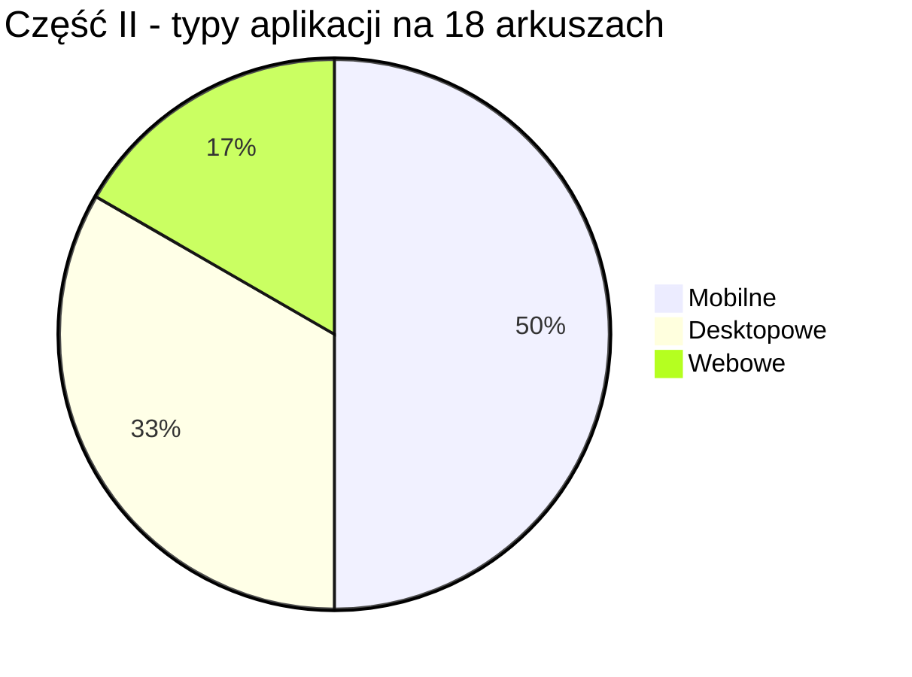
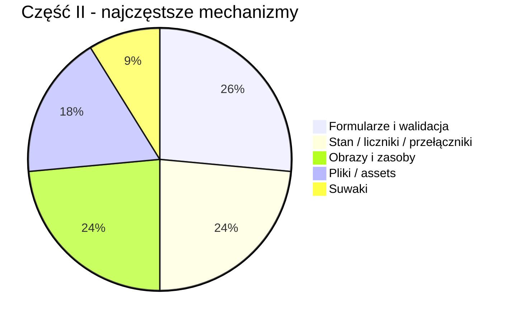

# Analiza arkuszy INF.04 — Część II: Aplikacja graficzna

> [!NOTE]
> Analiza obejmuje **18 arkuszy egzaminacyjnych z lat 2021–2026**. Skupiam się wyłącznie na **Części II**, czyli aplikacji **mobilnej**, **desktopowej** albo **webowej**. W tej części najważniejsze są: odtworzenie widoku z obrazka, obsługa zdarzeń, przechowywanie stanu aplikacji, praca z zasobami graficznymi i prosta walidacja danych.

---

## 📋 Spis zadań — arkusz po arkuszu

### 1. 🗓️ 2021 – Czerwiec 1

| Aspekt | Szczegóły |
|---|---|
| **Typ aplikacji** | 📱 Mobilna |
| **Temat** | Rejestracja konta — e-mail i hasło |
| **Kategoria** | 🧾 Formularz + ✅ walidacja |
| **Opis** | Aplikacja zawiera tytuł „Rejestruj konto”, pole e-mail, dwa pola hasła z ukrywaniem znaków, przycisk „ZATWIERDŹ” oraz obszar komunikatu. Po kliknięciu przycisku sprawdzany jest znak `@` w adresie e-mail oraz zgodność haseł. |
| **Trudność** | ⭐⭐ Niska-średnia |
| **Kluczowe umiejętności** | Pola tekstowe, tryb hasła, kliknięcie przycisku, `contains("@")`, porównanie napisów, aktualizacja etykiety |
| **Narzędzia UI** | Android XML / XAML, `EditText`/`Entry`, `Button`, `TextView`/`Label`, layout liniowy |

---

### 2. 🗓️ 2022 – Styczeń 1

| Aspekt | Szczegóły |
|---|---|
| **Typ aplikacji** | 📱 Mobilna |
| **Temat** | Rejestracja konta — **identyczna jak 2021 Cze 1** |
| **Kategoria** | 🧾 Formularz + ✅ walidacja |
| **Opis** | Powtórzenie zadania z rejestracją konta: e-mail, hasło, powtórzenie hasła, przycisk zatwierdzający i komunikat zależny od wyniku walidacji. |
| **Trudność** | ⭐⭐ Niska-średnia |
| **Kluczowe umiejętności** | Identyczne jak powyżej |
| **Narzędzia UI** | Identyczne jak powyżej |

---

### 3. 🗓️ 2022 – Czerwiec 1

| Aspekt | Szczegóły |
|---|---|
| **Typ aplikacji** | 📱 Mobilna |
| **Temat** | Oferta turystyczna — licznik polubień |
| **Kategoria** | 🖼️ Widok z obrazem + 🔢 licznik |
| **Opis** | Aplikacja prezentuje ofertę „Domek w górach”: tytuł, obraz, trzy przyciski „POLUB”, „USUŃ”, „ZAPISZ”, licznik polubień, linię i opis. „POLUB” zwiększa licznik, „USUŃ” zmniejsza go, ale liczba polubień nie może spaść poniżej zera. |
| **Trudność** | ⭐⭐ Niska |
| **Kluczowe umiejętności** | Obraz z zasobów, licznik w zmiennej, obsługa kilku przycisków, ograniczenie wartości minimalnej, aktualizacja tekstu |
| **Narzędzia UI** | `Image`, `Button`, `Label/TextView`, layout pionowy z zagnieżdżonym układem poziomym |

---

### 4. 🗓️ 2022 – Czerwiec 2

| Aspekt | Szczegóły |
|---|---|
| **Typ aplikacji** | 🌐 Webowa |
| **Temat** | Zapisy na kursy |
| **Kategoria** | 🧾 Formularz + 🔁 renderowanie tablicy |
| **Opis** | Jednokomponentowa aplikacja Angular lub React z Bootstrapem. Komponent przechowuje tablicę kursów, wyświetla liczbę kursów, listę numerowaną i formularz: imię i nazwisko, numer kursu, przycisk „Zapisz do kursu”. Po zatwierdzeniu wypisuje dane w konsoli, a dla złego numeru kursu komunikat „Nieprawidłowy numer kursu”. |
| **Trudność** | ⭐⭐⭐ Średnia |
| **Kluczowe umiejętności** | Komponent, tablica danych, pętla w widoku, formularz, obsługa submit, indeksowanie kursów, Bootstrap |
| **Narzędzia UI** | React/Angular, `map()`/`*ngFor`, `useState`/`ngModel`, `console.log`, `form-control`, `btn` |

---

### 5. 🗓️ 2023 – Styczeń 1

| Aspekt | Szczegóły |
|---|---|
| **Typ aplikacji** | 🖥️ Desktopowa |
| **Temat** | Dodawanie pracownika i generowanie hasła |
| **Kategoria** | 🧾 Formularz + 🎲 losowanie |
| **Opis** | Okno „Dodaj pracownika” z danymi pracownika, listą stanowisk i sekcją generowania hasła. Użytkownik podaje długość hasła oraz wybiera, czy hasło ma zawierać wielkie litery, cyfry i znaki specjalne. Przycisk generuje hasło jako komunikat, a „Zatwierdź” pokazuje dane pracownika wraz z wcześniej wygenerowanym hasłem. |
| **Trudność** | ⭐⭐⭐ Średnia |
| **Kluczowe umiejętności** | `TextBox`, `ComboBox`, `CheckBox`, generowanie losowych znaków, zapamiętanie hasła, komunikaty |
| **Narzędzia UI** | WPF/WinForms, `MessageBox`, grupy kontrolek, zdarzenia `Click`, generator stringów |

---

### 6. 🗓️ 2023 – Styczeń 2

| Aspekt | Szczegóły |
|---|---|
| **Typ aplikacji** | 📱 Mobilna |
| **Temat** | Proste notatki tekstowe |
| **Kategoria** | 📝 Lista + ➕ dodawanie elementów |
| **Opis** | Aplikacja z polem „Nowy element”, przyciskiem „DODAJ” i listą notatek. W stanie początkowym wyświetla trzy notatki z pliku `dane.txt` albo wpisane ręcznie. Po kliknięciu przycisku treść z pola jest dopisywana jako ostatni element listy. |
| **Trudność** | ⭐⭐ Niska-średnia |
| **Kluczowe umiejętności** | Kolekcja napisów, powiązanie listy z widokiem, dodawanie elementu, odświeżenie listy |
| **Narzędzia UI** | `ListView`/`RecyclerView`, `ObservableCollection` lub lista, `Entry/EditText`, `Button` |

---

### 7. 🗓️ 2023 – Czerwiec 1

| Aspekt | Szczegóły |
|---|---|
| **Typ aplikacji** | 🖥️ Desktopowa |
| **Temat** | Nadawanie przesyłki pocztowej |
| **Kategoria** | 🔘 Radio buttony + ✅ walidacja |
| **Opis** | Okno „Nadaj Przesyłkę” z wyborem typu przesyłki: Pocztówka, List, Paczka. Przycisk „Sprawdź Cenę” zmienia obraz oraz cenę. Przycisk „Zatwierdź” waliduje kod pocztowy: musi mieć dokładnie 5 znaków i składać się z samych cyfr. |
| **Trudność** | ⭐⭐⭐ Średnia |
| **Kluczowe umiejętności** | Grupa `RadioButton`, zmiana obrazu, aktualizacja etykiety, sprawdzenie długości i cyfr, komunikaty |
| **Narzędzia UI** | WPF/WinForms, `GroupBox`, `RadioButton`, `Image`, `Label`, `MessageBox` |

---

### 8. 🗓️ 2023 – Czerwiec 2

| Aspekt | Szczegóły |
|---|---|
| **Typ aplikacji** | 📱 Mobilna |
| **Temat** | Właściwości czcionki |
| **Kategoria** | 🎚️ Suwak + 🔁 cykliczna zmiana tekstu |
| **Opis** | Ekran z tytułem, suwakiem rozmiaru czcionki, cytatem i przyciskiem „>>”. Przesunięcie suwaka aktualizuje wartość przy napisie „Rozmiar:” oraz rozmiar czcionki cytatu. Przycisk cyklicznie zmienia tekst: „Dzień dobry”, „Good morning”, „Buenos dias”. |
| **Trudność** | ⭐⭐⭐ Średnia |
| **Kluczowe umiejętności** | Obsługa suwaka, zmiana `FontSize`, tablica napisów, indeks cykliczny, aktualizacja widoku |
| **Narzędzia UI** | `Slider`/`SeekBar`, `Label/TextView`, `Button`, tablica 3 elementów |

---

### 9. 🗓️ 2023 – Czerwiec 3

| Aspekt | Szczegóły |
|---|---|
| **Typ aplikacji** | 🌐 Webowa |
| **Temat** | Formularz dodawania filmu |
| **Kategoria** | 🧾 Formularz + Bootstrap |
| **Opis** | Jednokomponentowa aplikacja Angular lub React z formularzem: pole „Tytuł filmu”, lista „Rodzaj” z opcjami Komedia, Obyczajowy, Sensacyjny, Horror oraz przycisk „Dodaj”. Po kliknięciu dane formularza są wypisywane w konsoli przeglądarki. |
| **Trudność** | ⭐⭐ Niska-średnia |
| **Kluczowe umiejętności** | Formularz, `select`, obsługa kliknięcia/submit, Bootstrap, `console.log` |
| **Narzędzia UI** | React/Angular, `input`, `select`, `button`, klasy Bootstrap |

---

### 10. 🗓️ 2024 – Styczeń 1

| Aspekt | Szczegóły |
|---|---|
| **Typ aplikacji** | 🖥️ Desktopowa |
| **Temat** | Dane paszportowe |
| **Kategoria** | 🖼️ Zasoby graficzne + 🧾 formularz |
| **Opis** | Okno do wprowadzania numeru, imienia, nazwiska i koloru oczu. Po opuszczeniu pola „Numer” aplikacja aktualizuje dwa obrazy według schematu `<numer>-zdjecie.jpg` i `<numer>-odcisk.jpg`. Przycisk „OK” wyświetla dane i kolor oczu albo komunikat „Wprowadź dane”. |
| **Trudność** | ⭐⭐⭐ Średnia |
| **Kluczowe umiejętności** | Zdarzenie opuszczenia pola, dynamiczne nazwy plików, obrazy, radio buttony, walidacja pustych pól |
| **Narzędzia UI** | WPF/WinForms, `TextBox`, `RadioButton`, `Image`, `LostFocus`, `MessageBox` |

---

### 11. 🗓️ 2024 – Styczeń 2

| Aspekt | Szczegóły |
|---|---|
| **Typ aplikacji** | 📱 Mobilna |
| **Temat** | Wizyta u weterynarza |
| **Kategoria** | 🧾 Formularz + 🎚️ suwak zależny od wyboru |
| **Opis** | Formularz wizyty: właściciel, gatunek zwierzęcia, wiek, cel wizyty, czas i przycisk „OK”. Wybór gatunku zmienia maksymalną wartość suwaka wieku: pies 18, kot 20, świnka morska 9. Suwak aktualizuje wiek, a przycisk pokazuje podsumowanie danych rozdzielonych przecinkami. |
| **Trudność** | ⭐⭐⭐ Średnia |
| **Kluczowe umiejętności** | Lista wyboru, slider z dynamicznym maksimum, pole czasu, składanie komunikatu z formularza |
| **Narzędzia UI** | Android/MAUI, `ListView`/`Picker`, `Slider`, `TimePicker`, `Entry`, `Label` |

---

### 12. 🗓️ 2024 – Czerwiec 1

| Aspekt | Szczegóły |
|---|---|
| **Typ aplikacji** | 📱 Mobilna |
| **Temat** | Gra w kości — wynik rzutu i wynik gry |
| **Kategoria** | 🎲 Gra + 🖼️ obrazy + 🔢 wynik narastający |
| **Opis** | Aplikacja mobilna do gry w pięć kości. W stanie początkowym pokazuje pięć obrazów `question.jpg`, przycisk „RZUĆ KOŚĆMI”, wynik tego losowania, wynik gry oraz przycisk „RESETUJ WYNIK”. Rzut losuje pięć wartości 1..6, zmienia obrazy kości, liczy wynik rzutu według algorytmu z części konsolowej i dodaje go do wyniku gry. Reset przywraca obrazy pytajnika oraz zeruje oba wyniki. |
| **Trudność** | ⭐⭐⭐⭐ Średnia-trudna |
| **Kluczowe umiejętności** | Losowanie pięciu kości, mapowanie wartości na obraz, wynik bieżącego rzutu, wynik narastający, reset stanu, wykorzystanie logiki z części I |
| **Narzędzia UI** | Android/MAUI, `Image`, `Button`, `Label`, lista obrazów, `random`, layout pionowy i poziomy |

---

### 13. 🗓️ 2024 – Czerwiec 2

| Aspekt | Szczegóły |
|---|---|
| **Typ aplikacji** | 🖥️ Desktopowa |
| **Temat** | MojeDźwięki — przeglądarka albumów |
| **Kategoria** | 📄 Odczyt pliku + ⏮️ nawigacja + 🔢 licznik |
| **Opis** | Aplikacja desktopowa wczytuje albumy z pliku `Dane.txt` i pokazuje dane pierwszego albumu: wykonawcę, tytuł, liczbę utworów, rok i pobrania. Przyciski ze strzałkami przechodzą do poprzedniego/następnego albumu z zawijaniem na końcach listy. Przycisk „Pobierz” zwiększa liczbę pobrań aktualnego albumu i zapamiętuje zmianę w czasie działania programu. |
| **Trudność** | ⭐⭐⭐⭐ Średnia-trudna |
| **Kluczowe umiejętności** | Odczyt danych z pliku, lista obiektów albumów, indeks aktualnego elementu, nawigacja cykliczna, aktualizacja widoku, licznik pobrań |
| **Narzędzia UI** | WPF/WinForms, `ImageButton`/`Button`, `Label`, `Image`, parsing pliku, lista obiektów |

---

### 14. 🗓️ 2025 – Styczeń 1

| Aspekt | Szczegóły |
|---|---|
| **Typ aplikacji** | 🌐 Webowa |
| **Temat** | Galeria zdjęć z kategoriami |
| **Kategoria** | 🖼️ Galeria + 🔎 filtrowanie + 🔢 licznik |
| **Opis** | Aplikacja React lub Angular z tablicą obiektów zdjęć z `dane.txt`. Trzy przełączniki kategorii: Kwiaty, Zwierzęta, Samochody sterują widocznością zdjęć. Każdy blok zdjęcia pokazuje obraz, liczbę pobrań i przycisk „Pobierz”, który zwiększa licznik w tablicy i natychmiast odświeża widok. |
| **Trudność** | ⭐⭐⭐⭐ Średnia-trudna |
| **Kluczowe umiejętności** | Tablica obiektów, assets, filtrowanie warunkowe, pętla renderująca, modyfikacja stanu, uniwersalność dla dowolnej liczby zdjęć |
| **Narzędzia UI** | React/Angular, Bootstrap switch, `map()`/`*ngFor`, `filter`/warunki, stan komponentu |

---

### 15. 🗓️ 2025 – Styczeń 2

| Aspekt | Szczegóły |
|---|---|
| **Typ aplikacji** | 📱 Mobilna |
| **Temat** | Urządzenia domowe — pralka i odkurzacz |
| **Kategoria** | 🏠 Panel urządzeń + 🔁 przełączanie stanu |
| **Opis** | Ekran z sekcją pralki i odkurzacza. Dla pralki użytkownik wpisuje numer programu 1..12, a przycisk „Zatwierdź” aktualizuje napis „Numer prania: <numer>”. Dla odkurzacza przycisk przełącza stan: „Włącz”/„Wyłącz” oraz „Odkurzacz wyłączony”/„Odkurzacz włączony”. |
| **Trudność** | ⭐⭐⭐ Średnia |
| **Kluczowe umiejętności** | Układ z obrazami, walidacja zakresu liczby, przełącznik bool, aktualizacja tekstu przycisku i etykiety |
| **Narzędzia UI** | `Image`, `Entry/EditText`, `Button`, `Label/TextView`, zmienna `bool`, prosta walidacja |

---

### 16. 🗓️ 2025 – Czerwiec 1

| Aspekt | Szczegóły |
|---|---|
| **Typ aplikacji** | 🖥️ Desktopowa |
| **Temat** | Wzornik kolorów RGB |
| **Kategoria** | 🎚️ Suwaki + 🎨 dynamiczny kolor |
| **Opis** | Okno z trzema suwakami R, G, B w zakresie 0–255, dużym prostokątem podglądu i przyciskiem „Pobierz”. Ruch suwaka zmienia wartości liczbowe oraz kolor dużego prostokąta. Przycisk zapisuje aktualny kolor do małego prostokąta i etykiety z wartością RGB. |
| **Trudność** | ⭐⭐⭐ Średnia |
| **Kluczowe umiejętności** | Trzy suwaki, zdarzenie zmiany wartości, konwersja RGB na kolor, rozdzielenie podglądu bieżącego i zapisanego |
| **Narzędzia UI** | WPF/WinForms, `Slider/TrackBar`, `Rectangle/Panel`, `Label`, `Color.FromRgb`/`Color.FromArgb` |

---

### 17. 🗓️ 2025 – Czerwiec 2

| Aspekt | Szczegóły |
|---|---|
| **Typ aplikacji** | 🖥️ Desktopowa |
| **Temat** | Graficzny interfejs szyfru Cezara |
| **Kategoria** | 🔐 Formularz algorytmiczny + 💾 zapis pliku |
| **Opis** | Aplikacja desktopowa jako GUI do szyfru Cezara z części konsolowej. Pobiera klucz i tekst, szyfruje po kliknięciu „Zaszyfruj”, a dla niepoprawnego klucza przyjmuje wartość 0. Drugi przycisk otwiera systemowe okno zapisu i zapisuje zaszyfrowany tekst do pliku. |
| **Trudność** | ⭐⭐⭐⭐ Średnia-trudna |
| **Kluczowe umiejętności** | Wielowierszowe pole tekstowe, parsowanie liczby z fallbackiem, wykorzystanie logiki z konsoli, `SaveFileDialog`, zapis pliku |
| **Narzędzia UI** | WPF/WinForms, `TextBox` multiline, `Button`, `Label/Border`, `SaveFileDialog`, obsługa plików |

---

### 18. 🗓️ 2026 – Styczeń 1

| Aspekt | Szczegóły |
|---|---|
| **Typ aplikacji** | 📱 Mobilna |
| **Temat** | Gra w kości — blokowanie kości |
| **Kategoria** | 🎲 Gra + 🖼️ obrazy + 🔁 stan obiektów |
| **Opis** | Aplikacja z pięcioma obrazami kości, przyciskiem „RZUT” i polem sumy oczek. Rzut losuje wartości tylko dla dostępnych kości, aktualizuje obrazy i sumę. Kliknięcie obrazu kości przełącza jej dostępność oraz przezroczystość: pełna widoczność albo 50%. |
| **Trudność** | ⭐⭐⭐⭐ Średnia-trudna |
| **Kluczowe umiejętności** | Tablica/lista kości, losowanie, zmiana obrazu według wartości, suma, kliknięcie obrazu, opacity jako informacja o stanie |
| **Narzędzia UI** | Android/MAUI, `ImageButton` lub klikany `Image`, `Button`, `Label`, tablica obiektów, `random` |

---

## 📊 Wnioski i podsumowanie

### Podział według typu aplikacji

| Typ aplikacji | Liczba arkuszy | Arkusze |
|---|---:|---|
| **Mobilna** | 9 | 2021 Cze 1, 2022 Sty 1, 2022 Cze 1, 2023 Sty 2, 2023 Cze 2, 2024 Sty 2, 2024 Cze 1, 2025 Sty 2, 2026 Sty 1 |
| **Desktopowa** | 6 | 2023 Sty 1, 2023 Cze 1, 2024 Sty 1, 2024 Cze 2, 2025 Cze 1, 2025 Cze 2 |
| **Webowa** | 3 | 2022 Cze 2, 2023 Cze 3, 2025 Sty 1 |

### Podział tematyczny

| Kategoria | Liczba arkuszy | Arkusze |
|---|---:|---|
| **Formularze i walidacja** | 9 | 2021 Cze 1, 2022 Sty 1, 2022 Cze 2, 2023 Sty 1, 2023 Cze 1, 2023 Cze 3, 2024 Sty 1, 2024 Sty 2, 2025 Cze 2 |
| **Stan aplikacji / liczniki / przełączniki** | 8 | 2022 Cze 1, 2023 Sty 2, 2024 Cze 1, 2024 Cze 2, 2025 Sty 1, 2025 Sty 2, 2025 Cze 1, 2026 Sty 1 |
| **Obrazy i zasoby graficzne** | 8 | 2022 Cze 1, 2023 Cze 1, 2024 Sty 1, 2024 Cze 1, 2024 Cze 2, 2025 Sty 1, 2025 Sty 2, 2026 Sty 1 |
| **Suwaki i dynamiczna zmiana UI** | 3 | 2023 Cze 2, 2024 Sty 2, 2025 Cze 1 |
| **Odczyt/zapis plików lub danych z assets** | 6 | 2023 Sty 2, 2024 Sty 1, 2024 Cze 1, 2024 Cze 2, 2025 Sty 1, 2025 Cze 2 |
| **Integracja z logiką z Części I** | 5 | 2024 Cze 1, 2024 Cze 2, 2025 Sty 2, 2025 Cze 2, 2026 Sty 1 |

### Kluczowe obserwacje

> [!IMPORTANT]
> **Część II to UI + zdarzenia + stan.** Najwięcej punktów wraca do tych samych schematów: poprawnie nazwane kontrolki, obsługa kliknięcia, odczyt danych z pól, zmiana etykiety/obrazu i utrzymanie stanu w zmiennych lub kolekcjach.

1. **Aplikacje mobilne dominują** — 9 z 18 arkuszy to aplikacje mobilne. Najczęściej wystarcza układ liniowy, XML/XAML, kilka etykiet, przyciski, obrazy i proste zmienne stanu.

2. **Desktop jest bardziej „systemowy”** — pojawiają się `MessageBox`, zdarzenia typu `LostFocus`, dynamiczne ładowanie obrazów, `SaveFileDialog`, suwaki i wczytywanie danych z pliku.

3. **Web jest rzadki, ale konsekwentny** — zawsze Angular lub React, jeden komponent, Bootstrap, formularze, tablice, pętle i warunkowe renderowanie.

4. **Nowy trend od 2024 Czerwiec: integracja z Częścią I** — zadania coraz częściej sugerują wykorzystanie logiki z aplikacji konsolowej: kości, albumy, urządzenia domowe, szyfr Cezara. To oznacza, że warto oddzielać logikę od interfejsu.

5. **Obrazy są bardzo częste** — grafiki ofert, przesyłek, paszportów, kości, albumów i urządzeń pojawiają się w 8 arkuszach. Błędy w ścieżkach, assets i nazwach plików łatwo blokują działanie aplikacji.

6. **Walidacja jest prosta, ale obowiązkowa** — e-mail z `@`, zgodność haseł, kod pocztowy jako 5 cyfr, puste pola, zakres 1..12, poprawny numer kursu, klucz jako liczba całkowita.

7. **Nowsze arkusze wymagają świadomego modelowania stanu** — od 2024–2026 mamy wynik gry, aktualny album, pobrania zdjęć, zapisany kolor RGB, stan odkurzacza i blokowane kości.

### Co musisz umieć w Części II

| Umiejętność | Priorytet | Gdzie się pojawia |
|---|---|---|
| Tworzenie layoutu zgodnego z obrazem | 🔴 Krytyczne | Wszystkie arkusze |
| Obsługa kliknięcia przycisku | 🔴 Krytyczne | Prawie wszystkie |
| Odczyt i zapis wartości pól tekstowych | 🔴 Krytyczne | Formularze mobilne, webowe i desktopowe |
| Aktualizacja etykiet/napisów po zdarzeniu | 🔴 Krytyczne | Prawie wszystkie |
| Przechowywanie stanu w zmiennych | 🔴 Krytyczne | Liczniki, hasło, kości, albumy, pobrania, RGB |
| Walidacja danych wejściowych | 🟠 Ważne | Rejestracja, poczta, paszport, pralka, szyfr, kursy |
| Dodawanie i zmiana obrazów | 🟠 Ważne | Oferta, poczta, paszport, kości, albumy, galeria, urządzenia |
| Listy, tablice i pętle w widoku | 🟠 Ważne | Kursy, notatki, albumy, galeria, kości |
| Odczyt danych z pliku | 🟠 Ważne | Notatki, albumy, galeria, zasoby graficzne |
| Suwaki i zakresy wartości | 🟡 Przydatne | Czcionka, weterynarz, RGB |
| Bootstrap / komponent webowy | 🟡 Przydatne | 3 arkusze webowe |
| Zapis pliku przez okno dialogowe | 🟡 Przydatne | 2025 Cze 2 |

> [!TIP]
> **Schemat rozwiązania typowej Części II:**
> 1. Najpierw odtwórz widok z obrazka: kontrolki, teksty, kolory, marginesy.
> 2. Nadaj kontrolkom znaczące nazwy, np. `emailEntry`, `resultLabel`, `rollButton`.
> 3. Dodaj zmienne stanu: licznik, aktualny indeks, lista obiektów, wynik gry, wybrany kolor.
> 4. Podłącz zdarzenia: kliknięcie, zmiana suwaka, wybór z listy, opuszczenie pola, kliknięcie obrazu.
> 5. W zdarzeniu odczytaj dane z kontrolek, wykonaj logikę i odśwież widok.
> 6. Zrób zrzuty wymaganych stanów: start, po interakcji, po błędzie/walidacji, po resecie.

### Powtórzenia i wzorce

| Wzorzec | Pojawia się w |
|---|---|
| Rejestracja konta — e-mail + dwa hasła | 2021 Cze 1 = 2022 Sty 1 |
| Formularz + wypisanie danych po zatwierdzeniu | 2022 Cze 2, 2023 Cze 3, 2024 Sty 2 |
| Licznik aktualizowany przyciskiem | 2022 Cze 1, 2024 Cze 2, 2025 Sty 1 |
| Lista/kolekcja renderowana w widoku | 2022 Cze 2, 2023 Sty 2, 2024 Cze 2, 2025 Sty 1 |
| Suwak aktualizujący tekst/kolor/wartość | 2023 Cze 2, 2024 Sty 2, 2025 Cze 1 |
| Obraz zmieniany na podstawie stanu | 2023 Cze 1, 2024 Sty 1, 2024 Cze 1, 2024 Cze 2, 2026 Sty 1 |
| Prosta walidacja liczby lub tekstu | 2021 Cze 1, 2022 Sty 1, 2023 Cze 1, 2024 Sty 1, 2025 Sty 2, 2025 Cze 2 |
| Integracja GUI z logiką konsolową | 2024 Cze 1, 2024 Cze 2, 2025 Cze 2, 2026 Sty 1 |

### Najlepsza strategia przygotowania

| Obszar | Co ćwiczyć najpierw |
|---|---|
| **Mobilne** | XAML/XML, layout pionowy i poziomy, `Entry`, `Button`, `Label`, `Image`, `Slider`, lista |
| **Desktopowe** | WPF/WinForms, zdarzenia kontrolek, `MessageBox`, `Image`, `RadioButton`, `CheckBox`, `SaveFileDialog`, odczyt pliku |
| **Webowe** | React albo Angular, jeden komponent, stan komponentu, formularz, renderowanie tablic, warunki, Bootstrap |
| **Wspólne** | Stan aplikacji, walidacja, aktualizacja tekstu, dodawanie assets, modelowanie list obiektów, zrzuty ekranowe |

> [!IMPORTANT]
> Najbardziej opłacalny zestaw ćwiczeń przed egzaminem to: **formularz z walidacją**, **lista z dodawaniem elementów**, **galeria z filtrowaniem**, **suwaki RGB**, **zmiana obrazów po kliknięciu**, **wczytanie listy obiektów z pliku** oraz **oddzielenie logiki z Części I od interfejsu**. Ten zestaw pokrywa większość Części II.
