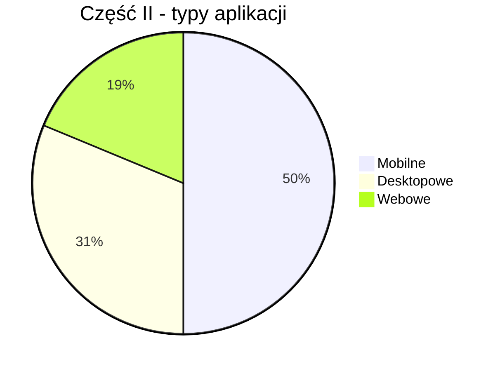
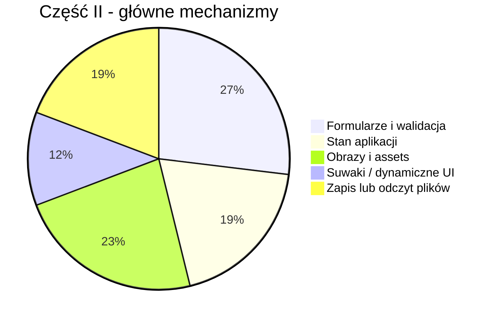

# Analiza arkuszy INF.04 — Część II: Aplikacja graficzna

> [!NOTE]
> Analiza obejmuje 16 arkuszy egzaminacyjnych z lat 2021–2026. Skupiam się wyłącznie na **Części II**, czyli aplikacji **mobilnej**, **desktopowej** albo **webowej**. W tej części najważniejsze nie są algorytmy, tylko poprawne zbudowanie interfejsu, obsługa zdarzeń i aktualizacja stanu aplikacji.

---

## 📋 Spis zadań — arkusz po arkuszu

### 1. 🗓️ 2021 – Czerwiec 1

| Aspekt | Szczegóły |
|---|---|
| **Typ aplikacji** | 📱 Mobilna |
| **Temat** | Rejestracja konta — e-mail i hasło |
| **Kategoria** | 🧾 Formularz + ✅ walidacja |
| **Opis** | Ekran z tytułem „Rejestruj konto”, polami e-mail, hasło i powtórz hasło oraz przyciskiem „ZATWIERDŹ”. Aplikacja sprawdza, czy e-mail zawiera `@`, czy hasła są takie same i wyświetla odpowiedni komunikat: błąd e-maila, różne hasła albo „Witaj <e-mail>”. |
| **Trudność** | ⭐⭐ Niska-średnia |
| **Kluczowe umiejętności** | Pola tekstowe, ukrywanie hasła, obsługa przycisku, prosta walidacja, komunikat tekstowy |
| **Narzędzia UI** | Android XML / XAML, `Entry`/`EditText`, `Button`, `Label/TextView`, layout liniowy |

---

### 2. 🗓️ 2022 – Styczeń 1

| Aspekt | Szczegóły |
|---|---|
| **Typ aplikacji** | 📱 Mobilna |
| **Temat** | Rejestracja konta — **identyczna jak 2021 Cze 1** |
| **Kategoria** | 🧾 Formularz + ✅ walidacja |
| **Opis** | Powtórzenie zadania z rejestracją konta: e-mail, dwa pola hasła, przycisk zatwierdzający i komunikat zależny od wyniku walidacji. |
| **Trudność** | ⭐⭐ Niska-średnia |
| **Kluczowe umiejętności** | Identyczne jak powyżej |
| **Narzędzia UI** | Identyczne jak powyżej |

---

### 3. 🗓️ 2022 – Czerwiec 1

| Aspekt | Szczegóły |
|---|---|
| **Typ aplikacji** | 📱 Mobilna |
| **Temat** | Oferta turystyczna — licznik polubień |
| **Kategoria** | 🖼️ Widok z obrazem + 🔢 licznik |
| **Opis** | Aplikacja wyświetla ofertę „Domek w górach”, obraz, przyciski „POLUB”, „USUŃ”, „ZAPISZ”, licznik polubień i opis. Przycisk „POLUB” zwiększa licznik, „USUŃ” zmniejsza go, ale nie poniżej zera. |
| **Trudność** | ⭐⭐ Niska |
| **Kluczowe umiejętności** | Zasoby graficzne, licznik w stanie aplikacji, obsługa kilku przycisków, layout pionowy i poziomy |
| **Narzędzia UI** | `Image`, `Button`, `Label`, liczba całkowita jako stan, layout zagnieżdżony |

---

### 4. 🗓️ 2022 – Czerwiec 2

| Aspekt | Szczegóły |
|---|---|
| **Typ aplikacji** | 🌐 Webowa |
| **Temat** | Zapisy na kursy |
| **Kategoria** | 🧾 Formularz + 🔁 renderowanie tablicy |
| **Opis** | Jednokomponentowa aplikacja Angular lub React. Zawiera tablicę kursów, wyświetla liczbę kursów, listę numerowaną oraz formularz: imię i nazwisko, numer kursu, przycisk „Zapisz do kursu”. Po zatwierdzeniu wypisuje w konsoli imię i nazwisko oraz nazwę kursu albo komunikat „Nieprawidłowy numer kursu”. |
| **Trudność** | ⭐⭐⭐ Średnia |
| **Kluczowe umiejętności** | Komponent, tablica danych, pętla w szablonie/JSX, formularz, submit, `console.log`, Bootstrap |
| **Narzędzia UI** | React lub Angular, Bootstrap, formularz kontrolowany lub odczyt z pól |

---

### 5. 🗓️ 2023 – Styczeń 1

| Aspekt | Szczegóły |
|---|---|
| **Typ aplikacji** | 🖥️ Desktopowa |
| **Temat** | Dodawanie pracownika i generowanie hasła |
| **Kategoria** | 🧾 Formularz + 🎲 losowanie |
| **Opis** | Okno „Dodaj pracownika” z danymi pracownika, listą stanowisk oraz sekcją generowania hasła. Użytkownik podaje długość hasła i wybiera, czy użyć wielkich liter, cyfr oraz znaków specjalnych. Przycisk generuje hasło jako komunikat, a „Zatwierdź” pokazuje dane pracownika wraz z hasłem. |
| **Trudność** | ⭐⭐⭐ Średnia |
| **Kluczowe umiejętności** | `TextBox`, `ComboBox`, `CheckBox`, generowanie losowych znaków, komunikaty, przechowywanie wygenerowanego hasła |
| **Narzędzia UI** | WPF/WinForms, `MessageBox`, grupy kontrolek, zdarzenia kliknięcia |

---

### 6. 🗓️ 2023 – Styczeń 2

| Aspekt | Szczegóły |
|---|---|
| **Typ aplikacji** | 📱 Mobilna |
| **Temat** | Proste notatki tekstowe |
| **Kategoria** | 📝 Lista + ➕ dodawanie elementów |
| **Opis** | Aplikacja z polem „Nowy element”, przyciskiem „DODAJ” i listą notatek. W stanie początkowym wyświetla 3 notatki z pliku `dane.txt` lub wpisane ręcznie. Po kliknięciu przycisku dopisuje nową notatkę jako ostatni element listy. |
| **Trudność** | ⭐⭐ Niska-średnia |
| **Kluczowe umiejętności** | Kolekcja napisów, lista powiązana z danymi, dodawanie do kolekcji, odświeżanie widoku |
| **Narzędzia UI** | `ListView`/`RecyclerView`, `ObservableCollection` lub lista, `Entry`, `Button` |

---

### 7. 🗓️ 2023 – Czerwiec 1

| Aspekt | Szczegóły |
|---|---|
| **Typ aplikacji** | 🖥️ Desktopowa |
| **Temat** | Nadawanie przesyłki pocztowej |
| **Kategoria** | 🔘 Radio buttony + ✅ walidacja |
| **Opis** | Okno „Nadaj Przesyłkę” z wyborem typu przesyłki: Pocztówka, List, Paczka. Przycisk „Sprawdź Cenę” zmienia obraz i cenę. Przycisk „Zatwierdź” sprawdza kod pocztowy: dokładnie 5 znaków i same cyfry. |
| **Trudność** | ⭐⭐⭐ Średnia |
| **Kluczowe umiejętności** | Grupa `RadioButton`, zmiana obrazu, aktualizacja etykiety, walidacja długości i cyfr, komunikaty |
| **Narzędzia UI** | WPF/WinForms, `GroupBox`, `RadioButton`, `Image`, `Label`, `MessageBox` |

---

### 8. 🗓️ 2023 – Czerwiec 2

| Aspekt | Szczegóły |
|---|---|
| **Typ aplikacji** | 📱 Mobilna |
| **Temat** | Właściwości czcionki |
| **Kategoria** | 🎚️ Suwak + 🔁 cykliczna zmiana tekstu |
| **Opis** | Ekran z tytułem, suwakiem rozmiaru czcionki, cytatem i przyciskiem „>>”. Przesunięcie suwaka aktualizuje wartość przy napisie „Rozmiar:” oraz rozmiar czcionki cytatu. Przycisk cyklicznie zmienia tekst: „Dzień dobry”, „Good morning”, „Buenos dias”. |
| **Trudność** | ⭐⭐⭐ Średnia |
| **Kluczowe umiejętności** | Obsługa suwaka, zmiana właściwości tekstu, tablica napisów, indeks cykliczny |
| **Narzędzia UI** | `Slider`/`SeekBar`, `Label/TextView`, `Button`, tablica 3 elementów |

---

### 9. 🗓️ 2023 – Czerwiec 3

| Aspekt | Szczegóły |
|---|---|
| **Typ aplikacji** | 🌐 Webowa |
| **Temat** | Formularz dodawania filmu |
| **Kategoria** | 🧾 Formularz + Bootstrap |
| **Opis** | Jednokomponentowa aplikacja Angular lub React z formularzem: pole „Tytuł filmu”, lista „Rodzaj” z opcjami Komedia, Obyczajowy, Sensacyjny, Horror oraz przycisk „Dodaj”. Po kliknięciu wypisuje dane formularza w konsoli przeglądarki. |
| **Trudność** | ⭐⭐ Niska-średnia |
| **Kluczowe umiejętności** | Formularz, `select`, obsługa submit/kliknięcia, Bootstrap, `console.log` |
| **Narzędzia UI** | React lub Angular, Bootstrap, `input`, `select`, `button` |

---

### 10. 🗓️ 2024 – Styczeń 1

| Aspekt | Szczegóły |
|---|---|
| **Typ aplikacji** | 🖥️ Desktopowa |
| **Temat** | Dane paszportowe |
| **Kategoria** | 🖼️ Zasoby graficzne + 🧾 formularz |
| **Opis** | Okno do wprowadzania numeru, imienia, nazwiska i koloru oczu. Po opuszczeniu pola „Numer” aplikacja aktualizuje dwa obrazy według schematu `<numer>-zdjecie.jpg` i `<numer>-odcisk.jpg`. Przycisk „OK” wyświetla dane i kolor oczu albo komunikat „Wprowadź dane”. |
| **Trudność** | ⭐⭐⭐ Średnia |
| **Kluczowe umiejętności** | Zdarzenie opuszczenia pola, dynamiczne nazwy plików, obrazki, radio buttony, walidacja pustych pól |
| **Narzędzia UI** | WPF/WinForms, `TextBox`, `RadioButton`, `Image`, `LostFocus`, `MessageBox` |

---

### 11. 🗓️ 2024 – Styczeń 2

| Aspekt | Szczegóły |
|---|---|
| **Typ aplikacji** | 📱 Mobilna |
| **Temat** | Wizyta u weterynarza |
| **Kategoria** | 🧾 Formularz + 🎚️ suwak zależny od wyboru |
| **Opis** | Formularz wizyty: właściciel, gatunek zwierzęcia, wiek, cel wizyty, czas i przycisk „OK”. Wybór gatunku zmienia maksymalną wartość suwaka wieku: pies 18, kot 20, świnka morska 9. Suwak aktualizuje wiek, a przycisk pokazuje podsumowanie danych. |
| **Trudność** | ⭐⭐⭐ Średnia |
| **Kluczowe umiejętności** | Lista wyboru, slider z dynamicznym maksimum, pole czasu, składanie komunikatu z danych formularza |
| **Narzędzia UI** | Android/MAUI, `ListView`/`Picker`, `Slider`, `TimePicker`, `Entry`, `Label` |

---

### 12. 🗓️ 2025 – Styczeń 1

| Aspekt | Szczegóły |
|---|---|
| **Typ aplikacji** | 🌐 Webowa |
| **Temat** | Galeria zdjęć z kategoriami |
| **Kategoria** | 🖼️ Galeria + 🔎 filtrowanie + 🔢 licznik |
| **Opis** | Aplikacja React lub Angular z tablicą obiektów zdjęć z `dane.txt`. Trzy przełączniki kategorii: Kwiaty, Zwierzęta, Samochody sterują widocznością zdjęć. Każdy blok zdjęcia pokazuje obraz, liczbę pobrań i przycisk „Pobierz”, który zwiększa licznik w tablicy i odświeża widok. |
| **Trudność** | ⭐⭐⭐⭐ Średnia-trudna |
| **Kluczowe umiejętności** | Tablica obiektów, assets, filtrowanie warunkowe, pętla renderująca, modyfikacja stanu, komponent uniwersalny dla dowolnej liczby zdjęć |
| **Narzędzia UI** | React/Angular, Bootstrap switch, `map`/`*ngFor`, `filter`/warunki, stan komponentu |

---

### 13. 🗓️ 2025 – Styczeń 2

| Aspekt | Szczegóły |
|---|---|
| **Typ aplikacji** | 📱 Mobilna |
| **Temat** | Urządzenia domowe — pralka i odkurzacz |
| **Kategoria** | 🏠 Panel urządzeń + 🔁 przełączanie stanu |
| **Opis** | Ekran z sekcją pralki i odkurzacza. Dla pralki użytkownik wpisuje numer programu 1..12, a przycisk „Zatwierdź” aktualizuje napis. Dla odkurzacza przycisk przełącza stan: „Włącz”/„Wyłącz” oraz „Odkurzacz wyłączony”/„Odkurzacz włączony”. |
| **Trudność** | ⭐⭐⭐ Średnia |
| **Kluczowe umiejętności** | Układ z obrazami, walidacja zakresu liczby, przełącznik bool, aktualizacja tekstu przycisku i etykiety |
| **Narzędzia UI** | `Image`, `Entry`, `Button`, `Label`, zmienna `bool`, prosta walidacja |

---

### 14. 🗓️ 2025 – Czerwiec 1

| Aspekt | Szczegóły |
|---|---|
| **Typ aplikacji** | 🖥️ Desktopowa |
| **Temat** | Wzornik kolorów RGB |
| **Kategoria** | 🎚️ Suwaki + 🎨 dynamiczny kolor |
| **Opis** | Okno z trzema suwakami R, G, B w zakresie 0–255, dużym prostokątem podglądu i przyciskiem „Pobierz”. Ruch suwaka zmienia wartości liczbowe oraz kolor dużego prostokąta. Przycisk zapisuje aktualny kolor do małego prostokąta i etykiety z wartością RGB. |
| **Trudność** | ⭐⭐⭐ Średnia |
| **Kluczowe umiejętności** | Trzy suwaki, zdarzenie zmiany wartości, konwersja RGB na kolor, rozdzielenie podglądu bieżącego i zapisanego |
| **Narzędzia UI** | WPF/WinForms, `Slider/TrackBar`, `Rectangle/Panel`, `Label`, `Color.FromRgb` |

---

### 15. 🗓️ 2025 – Czerwiec 2

| Aspekt | Szczegóły |
|---|---|
| **Typ aplikacji** | 🖥️ Desktopowa |
| **Temat** | Graficzny interfejs szyfru Cezara |
| **Kategoria** | 🔐 Formularz algorytmiczny + 💾 zapis pliku |
| **Opis** | Aplikacja desktopowa jako GUI do szyfru Cezara z części konsolowej. Pobiera klucz i tekst, szyfruje po kliknięciu „Zaszyfruj”, a dla niepoprawnego klucza przyjmuje 0. Drugi przycisk otwiera systemowe okno zapisu i zapisuje zaszyfrowany tekst do pliku. |
| **Trudność** | ⭐⭐⭐⭐ Średnia-trudna |
| **Kluczowe umiejętności** | Wielowierszowe pole tekstowe, parsowanie liczby z fallbackiem, reuse logiki z konsoli, `SaveFileDialog`, zapis pliku |
| **Narzędzia UI** | WPF/WinForms, `TextBox` multiline, `Button`, `Label/Border`, `SaveFileDialog`, obsługa plików |

---

### 16. 🗓️ 2026 – Styczeń 1

| Aspekt | Szczegóły |
|---|---|
| **Typ aplikacji** | 📱 Mobilna |
| **Temat** | Gra w kości |
| **Kategoria** | 🎲 Gra + 🖼️ obrazy + 🔁 stan obiektów |
| **Opis** | Aplikacja z pięcioma obrazami kości, przyciskiem „RZUT” i polem sumy oczek. Rzut losuje wartości tylko dla dostępnych kości, aktualizuje obrazy i sumę. Kliknięcie obrazu kości przełącza jej dostępność oraz przezroczystość: 100% albo 50%. |
| **Trudność** | ⭐⭐⭐⭐ Średnia-trudna |
| **Kluczowe umiejętności** | Tablica/lista kości, losowanie, zmiana obrazu według wartości, suma, kliknięcie obrazu, opacity jako informacja o stanie |
| **Narzędzia UI** | Android/MAUI, `ImageButton`/klikany `Image`, `Button`, `Label`, tablica obiektów, `random` |

---

## 📊 Wnioski i podsumowanie

### Podział według typu aplikacji

| Typ aplikacji | Liczba arkuszy | Arkusze |
|---|---:|---|
| **Mobilna** | 8 | 2021 Cze 1, 2022 Sty 1, 2022 Cze 1, 2023 Sty 2, 2023 Cze 2, 2024 Sty 2, 2025 Sty 2, 2026 Sty 1 |
| **Desktopowa** | 5 | 2023 Sty 1, 2023 Cze 1, 2024 Sty 1, 2025 Cze 1, 2025 Cze 2 |
| **Webowa** | 3 | 2022 Cze 2, 2023 Cze 3, 2025 Sty 1 |

### Podział tematyczny

| Kategoria | Liczba arkuszy | Arkusze |
|---|---:|---|
| **Formularze i walidacja** | 7 | 2021 Cze 1, 2022 Sty 1, 2022 Cze 2, 2023 Cze 1, 2023 Cze 3, 2024 Sty 1, 2024 Sty 2 |
| **Stan aplikacji / liczniki / przełączniki** | 5 | 2022 Cze 1, 2023 Sty 2, 2025 Sty 1, 2025 Sty 2, 2026 Sty 1 |
| **Suwaki i dynamiczna zmiana UI** | 3 | 2023 Cze 2, 2024 Sty 2, 2025 Cze 1 |
| **Obrazy i zasoby aplikacji** | 6 | 2022 Cze 1, 2023 Cze 1, 2024 Sty 1, 2025 Sty 1, 2025 Sty 2, 2026 Sty 1 |
| **Logika algorytmiczna w GUI** | 3 | 2023 Sty 1, 2025 Cze 2, 2026 Sty 1 |
| **Zapis/odczyt danych z plików lub assets** | 5 | 2023 Sty 2, 2024 Sty 1, 2025 Sty 1, 2025 Cze 2, 2026 Sty 1 |

### Najczęściej wymagane umiejętności

### Kluczowe obserwacje

> [!IMPORTANT]
> **Część II to przede wszystkim UI + zdarzenia.** Najczęściej wystarczy zbudować widok zgodny z obrazem, podpiąć przyciski/suwaki/listy i aktualizować tekst, obraz albo licznik.

1. **Aplikacje mobilne dominują** — 8 z 16 arkuszy to aplikacje mobilne. Prawie zawsze wymagają layoutu liniowego, XML/XAML, emulatora, przycisku i aktualizacji tekstu.

2. **Web pojawia się rzadziej, ale jest bardziej „frameworkowy”** — arkusze webowe wymagają Reacta albo Angulara, jednego komponentu, pętli po tablicy, formularzy i Bootstrapa.

3. **Desktop to zwykle klasyczne kontrolki** — `TextBox`, `Label`, `Button`, `RadioButton`, `CheckBox`, `ComboBox`, `Image`, `Slider`. Trudność polega na poprawnym podpięciu zdarzeń.

4. **Stan aplikacji jest ważniejszy niż baza danych** — w tej części nie ma backendu ani relacyjnych baz danych. Dane są trzymane w zmiennych, listach, tablicach obiektów albo kontrolkach.

5. **Obrazy są częstym źródłem punktów i błędów** — trzeba umieć dodać pliki do zasobów/assets i zmieniać wyświetlany obraz zależnie od wyboru użytkownika.

6. **Walidacja jest prosta, ale punktowana** — najczęściej: pusty tekst, zakres liczby, same cyfry, zgodność haseł, obecność znaku `@`, poprawny numer kursu.

7. **Od 2025 rośnie złożoność interakcji** — galeria zdjęć, RGB, szyfr Cezara z zapisem pliku i gra w kości wymagają już świadomego modelowania stanu, nie tylko pojedynczego kliknięcia.

### Co musisz umieć w Części II

| Umiejętność | Priorytet | Gdzie się pojawia |
|---|---|---|
| Tworzenie prostego layoutu zgodnego z obrazem | 🔴 Krytyczne | Wszystkie arkusze |
| Obsługa kliknięcia przycisku | 🔴 Krytyczne | Prawie wszystkie |
| Odczyt i zapis wartości pól tekstowych | 🔴 Krytyczne | Formularze mobilne, webowe i desktopowe |
| Aktualizacja etykiet/napisów po zdarzeniu | 🔴 Krytyczne | Prawie wszystkie |
| Przechowywanie stanu w zmiennych | 🔴 Krytyczne | Liczniki, przełączniki, hasło, kości, pobrania |
| Walidacja danych wejściowych | 🟠 Ważne | Rejestracja, poczta, paszport, pralka, szyfr |
| Dodawanie i zmiana obrazów | 🟠 Ważne | Poczta, paszport, galeria, urządzenia, kości |
| Listy, tablice i pętle w widoku | 🟠 Ważne | Notatki, kursy, galeria, kości |
| Suwaki i zakresy wartości | 🟡 Przydatne | Czcionka, weterynarz, RGB |
| Bootstrap / komponent webowy | 🟡 Przydatne | 3 arkusze webowe |
| Zapis pliku przez okno dialogowe | 🟡 Przydatne | 2025 Cze 2 |

> [!TIP]
> **Schemat rozwiązania typowej Części II:**
> 1. Najpierw odtwórz widok z obrazka: kontrolki, teksty, kolory, marginesy.
> 2. Nazwij kontrolki sensownie, np. `emailEntry`, `submitButton`, `resultLabel`.
> 3. Dodaj zmienne stanu: licznik, aktualny indeks, wybrany kolor, lista zdjęć, tablica kości.
> 4. Podłącz zdarzenia: kliknięcie przycisku, zmiana suwaka, wybór z listy, opuszczenie pola.
> 5. W zdarzeniu odczytaj dane z kontrolek, wykonaj prostą logikę i odśwież widok.
> 6. Zrób zrzuty wymaganych stanów: początkowy, po interakcji, po błędzie/walidacji.

### Powtórzenia i wzorce

| Wzorzec | Pojawia się w |
|---|---|
| Rejestracja konta — e-mail + dwa hasła | 2021 Cze 1 = 2022 Sty 1 |
| Formularz + wypisanie danych po zatwierdzeniu | 2022 Cze 2, 2023 Cze 3, 2024 Sty 2 |
| Licznik aktualizowany przyciskiem | 2022 Cze 1, 2025 Sty 1 |
| Lista/kolekcja renderowana w widoku | 2022 Cze 2, 2023 Sty 2, 2025 Sty 1 |
| Suwak aktualizujący tekst/kolor/wartość | 2023 Cze 2, 2024 Sty 2, 2025 Cze 1 |
| Obraz zmieniany na podstawie stanu | 2023 Cze 1, 2024 Sty 1, 2026 Sty 1 |
| Prosta walidacja liczby lub tekstu | 2021 Cze 1, 2022 Sty 1, 2023 Cze 1, 2024 Sty 1, 2025 Sty 2, 2025 Cze 2 |

### Najlepsza strategia przygotowania

| Obszar | Co ćwiczyć najpierw |
|---|---|
| **Mobilne** | XAML/XML, layout pionowy i poziomy, `Entry`, `Button`, `Label`, `Image`, `Slider`, lista |
| **Desktopowe** | WPF/WinForms, zdarzenia kontrolek, `MessageBox`, `Image`, `RadioButton`, `CheckBox`, `SaveFileDialog` |
| **Webowe** | React albo Angular, jeden komponent, `useState`/stan komponentu, renderowanie tablic, Bootstrap |
| **Wspólne** | Stan aplikacji, walidacja, aktualizacja tekstu, dodawanie assets, robienie zrzutów ekranowych |

> [!IMPORTANT]
> Jeśli przygotowujesz się praktycznie, najbardziej opłacalny zestaw ćwiczeń to: **formularz z walidacją**, **lista z dodawaniem elementów**, **galeria z filtrowaniem**, **suwaki RGB**, **zmiana obrazów po kliknięciu**. Te pięć schematów pokrywa większość Części II.
