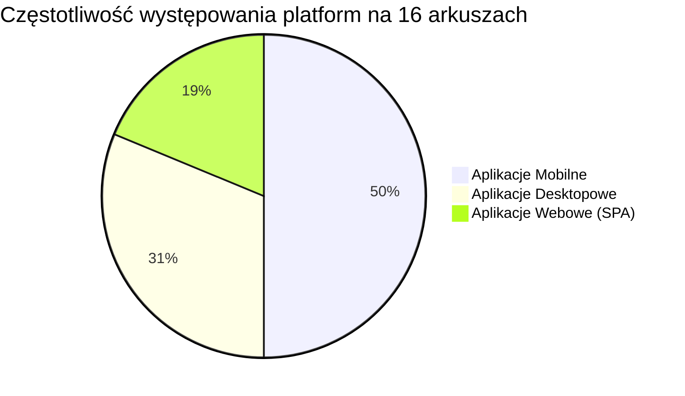

# Analiza arkuszy INF.04 — Część II: Aplikacja desktopowa / mobilna / webowa

> [!NOTE]
> Analiza obejmuje 16 arkuszy egzaminacyjnych z lat 2021–2026. Skupiam się na **Części II** egzaminu, która polega na stworzeniu aplikacji z graficznym interfejsem użytkownika. Aplikacje wymagają najczęściej zrealizowania środowisk: Desktopowego (np. WPF, JavaFX, Windows Forms), Mobilnego (Android Studio - Java/Kotlin lub Xamarin/MAUI - C#) lub Webowego (Angular, React.js + Bootstrap).

---

## 📋 Spis zadań — arkusz po arkuszu

### 1. 🗓️ 2021 – Czerwiec 1

| Aspekt | Szczegóły |
|---|---|
| **Typ aplikacji** | 📱 Aplikacja mobilna |
| **Temat** | Formularz rejestracji konta |
| **Opis** | Rejestracja z weryfikacją danych wejściowych. Należy wprowadzić e-mail, następnie wpisać hasło i je powtórzyć w pole ukrywające znak (password field). Po kliknięciu „ZATWIERDŹ” aplikacja weryfikuje posiadanie znaku `@` w e-mailu oraz czy oba wpisane hasła są identyczne. Wyświetla status odpowiednim komunikatem na wyjściu. |
| **Trudność** | ⭐ Niska |
| **Kluczowe umiejętności** | Tworzenie layoutu, TextEdit, walidacja formularzy, zdarzenie `onClick`. |

---

### 2. 🗓️ 2022 – Styczeń 1

| Aspekt | Szczegóły |
|---|---|
| **Typ aplikacji** | 📱 Aplikacja mobilna |
| **Temat** | Formularz rejestracji konta – **identyczne jak 2021 Cze 1** |
| **Opis** | Dokładnie to samo zadanie co 2021 Czerwiec 1. Weryfikacja konta (email, powtórz hasło, zatwierdź). |
| **Trudność** | ⭐ Niska |
| **Kluczowe umiejętności** | Identyczne jak powyżej |

---

### 3. 🗓️ 2022 – Czerwiec 1

| Aspekt | Szczegóły |
|---|---|
| **Typ aplikacji** | 📱 Aplikacja mobilna |
| **Temat** | Przeglądarka ofert turystycznych |
| **Opis** | Aplikacja składa się z galerii zdjęć, do której dodano obsługę przycisków typu "poprzedni" / "następny". Użytkownik widzi pożądaną ofertę turystyczną. |
| **Trudność** | ⭐⭐ Niska-średnia |
| **Kluczowe umiejętności** | Wyświetlanie obrazków (ImageView), nawigacja między stanami/indeksami w tablicy, obsługa przycisków. |

---

### 4. 🗓️ 2022 – Czerwiec 2

| Aspekt | Szczegóły |
|---|---|
| **Typ aplikacji** | 🌐 Aplikacja webowa (Front-end) |
| **Temat** | Formularz zapisu na kurs |
| **Opis** | Formularz obsługujący zapisy użytkowników. Zadanie wymusza użycia frameworka (Angular lub biblioteka React.js) wraz domyślnym podpięciem komponentów stylowanych poprzez sieć biblioteką Bootstrap. |
| **Trudność** | ⭐⭐ Średnia |
| **Kluczowe umiejętności** | Angular / React (tworzenie komponentów SPA), obsługa `<form>`, przypisywanie stanów `useState` / dwukierunkowe wiązanie np. `[(ngModel)]`, użycie klas Bootstrap (np. `form-control`, `btn btn-primary`). |

---

### 5. 🗓️ 2023 – Styczeń 1

| Aspekt | Szczegóły |
|---|---|
| **Typ aplikacji** | 💻 Aplikacja desktopowa |
| **Temat** | Dodawanie pracownika z generatorem hasła |
| **Opis** | Kompletny formularz desktopowy: zawiera pola tekstowe (imię, nazwisko, stanowisko), listę rozwijaną lub combobox oraz przycisk "Generuj Hasło", który obsługuje prosty algorytm wygenerowania silnego hasła dla nowego pracownika i wypisuje status do etykiety w aplikacji. |
| **Trudność** | ⭐⭐⭐ Średnia |
| **Kluczowe umiejętności** | Budowanie kontrolek interfejsu (ComboBox, TextBox), losowanie znaków i generator stringów na kliknięcie przycisku, Event Handling. |

---

### 6. 🗓️ 2023 – Styczeń 2

| Aspekt | Szczegóły |
|---|---|
| **Typ aplikacji** | 📱 Aplikacja mobilna |
| **Temat** | Proste notatki tekstowe |
| **Opis** | Aplikacja typu "todo list" w widoku mobilnym. Startowo ładuje dane notatek z pliku zewnętrznego `dane.txt`. Pozwala użytkownikowi wpisywać nową notatkę do pola tekstowego oraz na żądanie dodawać ją za pomocą kontrolki guzika, po czym odświeża i wyświela listę przy użyciu np. `ListView` / `RecyclerView`. |
| **Trudność** | ⭐⭐⭐ Średnia-wysoka |
| **Kluczowe umiejętności** | Odczyt plików lokalnych / zasobów androida, binding do listy (`ListView` lub `RecyclerView`), dodawanie elementu w locie. |

---

### 7. 🗓️ 2023 – Czerwiec 1

| Aspekt | Szczegóły |
|---|---|
| **Typ aplikacji** | 💻 Aplikacja desktopowa |
| **Temat** | Nadawanie przesyłki pocztowej |
| **Opis** | Należy utworzyć kalkulator kosztów, zawierający zgrupowane `RadioButtons` do wyboru konkretnego obiektu (Pocztówka / List / Paczka). Wciśnięcie przycisku „Sprawdź cenę” powinno uzależniać kwotę ceny wysłania podanego przez kalkulator w dolnej sekcji tekstowej oraz podświetlić interakcję z odpowiadającym mu zdjęciem na formacie. |
| **Trudność** | ⭐⭐ Średnia |
| **Kluczowe umiejętności** | RadioButtons i grupowanie kontrolek (`GroupBox` lub `ToggleGroup`), prosta logika warunkowa w obsłudze przycisku `Button::Click`. |

---

### 8. 🗓️ 2023 – Czerwiec 2

| Aspekt | Szczegóły |
|---|---|
| **Typ aplikacji** | 📱 Aplikacja mobilna |
| **Temat** | Aplikacja ustawień (Częściowa kontrola czcionki) |
| **Opis** | Prosta apka konfiguracji suwakowej. Użytkownik wykorzystuje element typu suwak (`Slider` / `SeekBar`) aby płynnie zmieniać pożądany wymiar rozmiaru elementu tekstowego u samej góry aplikacji. |
| **Trudność** | ⭐⭐ Niska-średnia |
| **Kluczowe umiejętności** | Obsługa zdarzeń `onChange` z suwaków, modyfikowanie atrybutów `FontSize` kontrolek w czasie rzeczywistym. |

---

### 9. 🗓️ 2023 – Czerwiec 3

| Aspekt | Szczegóły |
|---|---|
| **Typ aplikacji** | 🌐 Aplikacja webowa |
| **Temat** | Formularz rezerwacji z klasami Bootstrap |
| **Opis** | Podobnie do arkusza 2022 Czerwiec 2, aplikacja front-end SPA tworzona we frameworku React.js/Angular. Wymuszone jest ułożenie formularza stylami biblioteki obcej - `Bootstrap`. Zbieranie podstawowych metadanych, po podaniu danych użytkownik klika wpis lub 'Dodaj'. |
| **Trudność** | ⭐⭐ Średnia |
| **Kluczowe umiejętności** | Komponenty w wybranym frameworku front-end, operowanie stanami obiektu formularza oraz praca z Bootstrap form z internetu. |

---

### 10. 🗓️ 2024 – Styczeń 1

| Aspekt | Szczegóły |
|---|---|
| **Typ aplikacji** | 💻 Aplikacja desktopowa |
| **Temat** | Wprowadzanie danych paszportowych |
| **Opis** | Standardowy formularz okienkowy (WPF lub WinForms przykładowo w C#), na podstawie dołożonych obrazów, zdający musi zakodować formularz zawierający imię, nazwisko, kolor oczu, itp. Wykorzystano okna powiadomień `MessageBox`. Utrata skupienia (`focus()`) lub zmiana wartości powinna reagować powiadomieniami. |
| **Trudność** | ⭐⭐ Niska-średnia |
| **Kluczowe umiejętności** | Obsługa zdarzeń typu `FocusLost` (`onBlur` itp.), `MessageBox`, kontrolki `TextBox` i `ComboBox`. |

---

### 11. 🗓️ 2024 – Styczeń 2

| Aspekt | Szczegóły |
|---|---|
| **Typ aplikacji** | 📱 Aplikacja mobilna |
| **Temat** | Rezerwacja wizyty ui weterynarza |
| **Opis** | Aplikacja z formularzem w Xamarin/Maui bądź Android Studio. Wymagane użycie widgetów czasu takich jak Date i Time Pickers bądź suwakowego podejścia na temat tego, ile zwierzę ma lat. Powalająco wysoka ilość danych do zebrania. |
| **Trudność** | ⭐⭐⭐ Średnia |
| **Kluczowe umiejętności** | Skalowalność okna z ScrollView, wybierak wartości datownikowych. |

---

### 12. 🗓️ 2025 – Styczeń 1

| Aspekt | Szczegóły |
|---|---|
| **Typ aplikacji** | 🌐 Aplikacja webowa |
| **Temat** | Kategoryzacja oraz interakcje galerii |
| **Opis** | Ponownie aplikacja (React.js lub Angular), tworząca galerię wizualną. Poza wypisywaniem zdjęć z listy/stanu, należy dodać opcje do odfiltrowywania ("Kategoryzowania" poprzez np. opcje Zwierzęta, Samochody). Nacisk na interakcję z konkretnym zdjęciem (liczenie tzw. like'ów poprzez licznik na state/zmiennych). |
| **Trudność** | ⭐⭐⭐⭐ Średnia-trudna |
| **Kluczowe umiejętności** | Renderowanie z użyciem pętli `map()` / `*ngFor`, używanie stanu lokalnego, dynamiczne modyfikacje listy (filter). |

---

### 13. 🗓️ 2025 – Styczeń 2

| Aspekt | Szczegóły |
|---|---|
| **Typ aplikacji** | 📱 Aplikacja mobilna |
| **Temat** | Panel kontrolny `Smart Home` |
| **Opis** | Kontrola urządzeń. Aplikacja w trybie klikalnych kart na gridzie. Umożliwia klikanie wyłączenia/załączenia danego obiektu, co powoduje odświeżenie jego kafelka. Projekt opiera się o dziedziczności po urządzeniach z pierwszej części programowania strukturalnego OOP! |
| **Trudność** | ⭐⭐⭐ Średnia |
| **Kluczowe umiejętności** | Grid Layout elementu mobilnego. **Integracja wiedzy konsolowej (klas Urządzenie z Część I)**. |

---

### 14. 🗓️ 2025 – Czerwiec 1

| Aspekt | Szczegóły |
|---|---|
| **Typ aplikacji** | 💻 Aplikacja desktopowa |
| **Temat** | RGB Color Picker |
| **Opis** | Aplikacja z 3 suwakami RGB (Slider). Przy zmianie położeń któregokolwiek, aplikacja powinna "słuchać" na żywo wydarzeń i wstrzykiwać zaktualizowane informacje (Hex, odpowiednik liczbowy z zakresu 0-255 oraz podgląd graficznego kafelka) do widoku na ekranie. |
| **Trudność** | ⭐⭐⭐ Średnia |
| **Kluczowe umiejętności** | Dynamika pracy `OnChange` i nasłuchiwanie w czasie rzeczywistym. Konwersje ze String do int. Dynamiczna obsługa koloru Background elementu (np. `Color.FromArgb(r, g, b)`). |

---

### 15. 🗓️ 2025 – Czerwiec 2

| Aspekt | Szczegóły |
|---|---|
| **Typ aplikacji** | 💻 Aplikacja desktopowa |
| **Temat** | Aplikacja do szyfrowania wiadomości |
| **Opis** | Wymyślono interface w celu ukrycia konsoli. Wymagane jest poole na wpisanie słowa, zaznaczenie opcji szyfrowania (przycisk) i zaimplementowanie (wykorzystanie) funkcji z części konsolowej — Szyfr Cezara. Grafika obsługiwała Szyfrowanie po pętli. |
| **Trudność** | ⭐⭐⭐ Średnia |
| **Kluczowe umiejętności** | **Użycie napisanej logiki Części I (Szyfr Cezara)**, pobieranie z i wyświetlanie danych z kontrolki TextInput. |

---

### 16. 🗓️ 2026 – Styczeń 1

| Aspekt | Szczegóły |
|---|---|
| **Typ aplikacji** | 📱 Aplikacja mobilna |
| **Temat** | Interfejs do Gry w Kości |
| **Opis** | Zaprogramowanie wyglądu gry w pięć kości (5 pól obrazkowych). Po naciśnięciu wygenerowywały wylosowane obrazki i wpisywały się w grę. Koniecznie z zaleceniem importu bądź podpięcia logiki klasy Kość (`Kosc`), którą należało zaimplementować dla wariantu pierwszego. |
| **Trudność** | ⭐⭐⭐⭐ Średnia-trudna |
| **Kluczowe umiejętności** | **Ponowne nakłanianie do zaimportowania swojej logiki z cz. 1**, grid view bądź horizontal layout, mapowanie z indexów wyrzutów gier do adekwatnych grafik lokalnych. |

---

## 📊 Wnioski i podsumowanie

### Podział tematyczny (Typ środowiska/aplikacji)

| Środowisko docelowe | Liczba arkuszy | Arkusze (Rok) |
|---|---|---|
| **Aplikacje Mobilne 📱** | 8 | 2021 Cze1, 2022 Sty1, 2022 Cze1, 2023 Sty2, 2023 Cze2, 2024 Sty2, 2025 Sty2, 2026 Sty1 |
| **Aplikacje Desktopowe 💻** | 5 | 2023 Sty1, 2023 Cze1, 2024 Sty1, 2025 Cze1, 2025 Cze2 |
| **Aplikacje Webowe 🌐** | 3 | 2022 Cze2, 2023 Cze3, 2025 Sty1 |

### Kluczowe obserwacje egzaminacyjne CKE

> [!IMPORTANT]
> **NOWY TREND (2025 i 2026) – Rozwiązanie kaskadowe!**
> Do 2024 roku zadania Części I (konsola) i Części II (aplikacja okienkowa/mobilna/webowa) bywały na ogół odseparowane na płaszczyźnie logiki (Część II nie używała kodu napisanego w części pierwszej). Tymczasem **począwszy od 2025 Czerwiec 2 (np. Szyfr Cezara), 2025 Styczeń 2 (Urządzenia odkurzacze), jak i w najnowszym 2026 Styczeń 1 (Kości), komisja wprost sugeruje połączenie prac poprzez zaimplementowanie klas wyjściowych z Cześci I jako warstwy kontrolerów/domenowej w Części II z intefejsem wizualnym!** 

1. **Przeskok ku nowoczesnemu deweloperstwu (Web)** — Niespotykany w starszych rewizjach INF.04, typ zadań "Zastosuj bibliotekę React/Angular" (2022 Cze 2, 2023 Cze 3, 2025 Sty 1) sprawdza faktyczną zwinność frontendu SPA wykorzystując Node.js z typowymi frameworkami i designem Boostrap w tle. Jeżeli jest to aplikacja webowa to jest oceniana jej reaktywność.
2. **Krytyczne elementy w Mobilne/Desktop** — CKE notorycznie stawia na powtarzalny workflow, niezawodnie w 80% pytań powtarzają się schematy:
   * Kontrolki decyzyjne (`RadioButtons`, `Checkbox`, `ComboBox`)
   * Obsługa suwaków wartości (`Slider`) w locie przez nasłuchiwanie `onChange/onEvent`
   * Modyfikatory wizualne z poziomu kodu: nadpisywanie tekstu błędu (Error MessageBox, Toast), dynamika np. zmiana stylu lub zmiana samego pliku bazowego pobranego do kontrolki obrazu.
   
3. **Pliki graficzne i I/O** — W arkuszach 2022 Cze 1 (Oferty turystyczne), 2025 Sty 1 (Galeria) i 2026 Sty 1 (Kości gra) pojawiają się wymogi z dynamicznym załadowaniem konkretnej nazwy pliku konertowanej zmienną (np. `kosc` + `liczba_oczek` + `.png`).

> [!TIP]
> **Architektura do zapamiętania przed egzaminem z Części II:**
> Często brak poprawności pod względem estetycznym jest punktowany o połowę lżej od błędów w logice i walidowania `OnClick` (Dla np. rejestracji paszportów). Ważne żeby powiązać logiczną weryfikację podawaną w treści polecenia w odpowiednie obiekty, a błędy wypluwać odpowiednim ostrzeżeniem bądź wyczyszczeniem interfejsu (clear inputs). W zadaniach nowszego typu oddzielaj **logikę UI** od **Core Code'u** ze zrobionej w konsoli - zjawisko kaskadowania.
